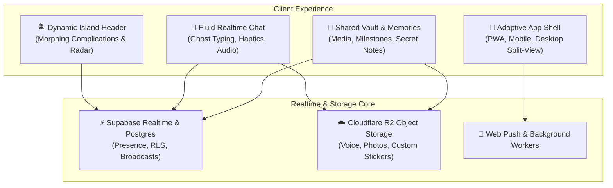

# AlaText — Full Product Feature Map & System Architecture

> **Document Version**: 2.4.0  
> **Status**: Production / Feature-Complete  
> **Target Audience**: Product Designers, UI/UX Specialists, Mobile Engineers & Stakeholders  
> **Repository**: `github.com/anupacj/alatext`

---

## 🌟 Executive Summary

**AlaText** is a high-craft, real-time messaging application engineered specifically for couples and close connections. Built with React Native (Expo SDK 57), Supabase Realtime, and Cloudflare R2, it combines the tactile physics of Apple iOS-grade fluid animations with emotionally resonant micro-interactions.

Unlike generic corporate messengers (WhatsApp, Telegram, Slack), every interaction in AlaText is tailored toward **intimacy, presence, playfulness, and shared memory curation**.



---

## 🗺️ Complete Feature Catalog

```
ALATEXT ECOSYSTEM
├── 1. Dynamic Island & Header System
│   ├── Floating 3-Pill Header
│   ├── Active Morphing (Typing, Audio Equalizer)
│   ├── "Thinking of You" Heart Ping State (Pure OLED + Pink Underglow)
│   ├── Camera Punch-Hole Clearance Safe Zone
│   ├── Interactive Expanded Card (Tap to Expand)
│   ├── Couple Compass & Distance Radar (Bearing + km/mi)
│   ├── Ephemeral Mood Chip (6h TTL)
│   └── Hardware Notch Calibration Engine
├── 2. Intimate Couple Micro-Interactions
│   ├── 4-Cycle Rhythmic Human Heartbeat Haptics
│   ├── Apple Intelligence Screen Edge Glow Halo
│   ├── Romantic Floating Hearts Particle Burst
│   ├── Bedtime Sleepy Bye Blocker & Quotes
│   └── Ghost Typing Live Keystroke Preview
├── 3. Rich Messaging & Media
│   ├── Markdown & Spoiler Tags (`||spoiler||`)
│   ├── Colon Emoji Autocomplete (`:smile:`)
│   ├── Shimmering Text (`ShinyText`)
│   ├── Voice Notes with Waveform Player
│   ├── Video Player with Inline / Fullscreen
│   ├── Clumped Media Album Grid
│   ├── Custom Sticker Packs & Upload
│   └── In-Chat Interactive Doodle Pad
├── 4. Real-Time HD Calling (WebRTC)
│   ├── 1-on-1 Low Latency Audio & Video
│   ├── Dynamic Island Active Call Complication
│   └── Live Duration, Mute, and Camera Toggles
├── 5. Shared Vault, Memories & Secret Notes
│   ├── Media Gallery (Photos, Videos, Audio Letters)
│   ├── Milestone Countdown & Anniversary Tracker
│   └── PIN-Protected Secret Notes Vault
├── 6. Theming, Atmosphere & Wallpapers
│   ├── Themes: AMOLED Jet Black, Midnight, Light, Rose Pink
│   ├── Multi-Slot Wallpaper Deck (Slots 1–5)
│   ├── Mood-Reactive Wallpaper Switching
│   └── Parallax Gyroscope Wallpaper Motion
└── 7. Security, Privacy & Performance
    ├── AlaPIN Lock Screen & Biometric Authentication
    ├── Idle Timeout & Auto-Lock on Blur
    ├── PWA Standalone Mode & Offline Caching
    └── Desktop Split-View Responsive Navigation
```

---

## 🧩 Deep-Dive Module Breakdown

### 1. Dynamic Island & Header System
* **Architecture**: Floating 3-pill header layout (Left: Navigation, Center: Dynamic Island, Right: Action & Heart ping).
* **Resting State**: Displays partner avatar, nickname, online/last-seen status, audio indicator, or live typing status.
* **Active State Morphing**:
  * **Typing Indicator**: Symmetrically expands with animated jumping dots.
  * **Audio Playing**: Live 4-bar equalizer complication pulsing with playback.
  * **"Thinking of You" Pill**: Pure OLED `#000000` body, ambient pink underglow aura radiating behind the pill, 48px camera punch-hole safe dead zone, pulsing heart icon on the left wing, and shimmering text on the right wing.
* **Expanded Interactive Card**:
  * Tap to expand into a floating card with partner info, mood chip, distance radar, and call controls.
  * Tap partner avatar inside the expanded card to initiate a smooth spring transition into the Full Profile / Chat Info screen.
* **Notch Calibration Engine**:
  * Configurable modes: `Dynamic Island`, `Camera Breathe` (drops header 10px below camera), `Corner Edge Dot` (for edge hole-punch displays), and `Classic Floating`.
  * Manual alignment sliders: Top offset, height, width ratio, squircle border radius, and alignment guide reticle.

### 2. Intimate Couple Micro-Interactions
* **Rhythmic Heartbeat Haptics**: Realistic dual-pulse cardiac rhythm (`lub-dub... lub-dub...`) executed across 4 consecutive cycles (`[70, 80, 140, 420, ...]`).
* **Apple Intelligence Glow Screen Halo**: Inset multi-corner gradient halo (`#E0507A`, `#F06B9C`, `#C9418F`, `#F4A0C0`) pulsing around the viewport perimeter when a heart ping is triggered or romantic text is received.
* **Floating Hearts Engine**: Physics-based floating heart particles rising up the screen when romantic keywords or heart emoji clusters are sent.
* **Sleepy Bye / Bedtime Blocker**:
  * Detects repetitive late-night farewell messages ("bye", "goodnight", "sleepy", "sweet dreams").
  * Intercepts continuous scrolling with a soothing nighttime overlay featuring romantic sleep quotes.
  * Requires a deliberate hold gesture to unlock if users wish to continue chatting.
* **Ghost Typing**: Real-time optional live keystroke preview showing partner's text as they type it before pressing send.

### 3. Couple Compass & Distance Radar
* **Concept**: Real-time distance and direction indicator keeping couples connected across distances without battery-draining continuous GPS tracking.
* **Distance Calculation**: Haversine formula calculation outputting distance in kilometers or miles with adaptive precision.
* **Live Compass Bearing**: Computes relative azimuth (0°–360°) and animates a rotating compass needle pointing toward partner's current position.
* **Privacy & Battery Policy**:
  * Updates on demand or at 20-minute gentle intervals.
  * **TTL Data Expiry**: Location records expire and self-delete after 40 minutes (2 ping cycles) to ensure neither party leaves persistent location traces.

### 4. 6-Hour Ephemeral Mood Status
* **Concept**: Quick, lightweight emotional check-in without requiring lengthy status updates.
* **Presets & Customization**: Quick preset chips (`🥰 Loved`, `😴 Sleepy`, `🥺 Missing You`, `✨ Happy`, `⚡ Busy`, `☕ Chilling`) or custom emoji + text note.
* **Persistence**: Synchronized over Supabase Realtime broadcast channels; automatically clears after 6 hours to keep feelings fresh and relevant.

### 5. Shared Vault, Memories & Secret Notes
* **Shared Media Gallery**: Unified gallery filtering by Photos, Videos, and Voice Letters exchanged in the conversation.
* **Memories & Milestones**:
  * Pinned core memories with milestone counter (e.g., *"✨ 248 Days Together"* or anniversary countdown).
* **Secret Notes Vault**:
  * Private notes, shared bucket lists, and intimate letters.
  * Protected behind a local PIN code or biometric lock for confidential entries.

### 6. Audio Letters & HD Voice Messaging
* **Waveform Audio Player**: Visual waveform scrub bar with dynamic duration formatting.
* **Dynamic Island Integration**: Equalizer complication pulses in the top pill whenever an audio letter is playing, allowing users to scroll and read while listening.
* **Cloud Storage**: Audio recorded as AAC/WebM and stored on Cloudflare R2 with fast global CDN delivery.

### 7. Real-Time HD Calling (WebRTC)
* **1-on-1 Voice & Video Calls**: Direct peer-to-peer WebRTC connection with Supabase signaling channels.
* **Island Complication**: Call state (incoming, ringing, connected) docks directly into the Dynamic Island with active duration timer and quick mute/hangup controls.

### 8. Theming, Wallpaper Deck & Atmosphere
* **Theme Palettes**: AMOLED Pure Black, Midnight Slate, Clean Light, Romantic Rose/Pink.
* **Multi-Slot Wallpaper Deck**: 5 persistent wallpaper slots switchable with one tap.
* **Mood-Reactive Wallpapers**: Automatic background transitions based on current mood (e.g. shifts to romantic blossom upon receiving love pings).
* **Parallax Motion**: Real-time accelerometer/gyroscope subtle parallax depth shift.

### 9. Input Dock, Custom Keyboard & Rich Text
* **Floating Glass Input Dock**: Translucent glass dock with integrated voice record, emoji picker, attachment drawer, and send trigger.
* **AlaGlass Keyboard**: Custom on-screen glassmorphic keyboard with slide-typing gesture path matching against English dictionary coordinates.
* **Colon Emoji Autocomplete**: Typing `:heart:` or `:kiss:` opens inline keyboard-navigable suggestions.
* **Rich Markdown**: In-bubble parsing of bold (`**`), italic (`*`), strikethrough (`~~`), code, and spoiler blocks (`||spoiler||`) that reveal on tap.

### 10. Security & Privacy
* **AlaPIN Engine**: 4-to-6 digit master security lock screen with biometric support (FaceID / Fingerprint / TouchID).
* **Auto-Lock on Blur**: Automatically locks the interface when the app is switched to the background or tab is changed.

---

## 🛠️ Technology Stack Reference

| Layer | Technology | Purpose |
| :--- | :--- | :--- |
| **Framework** | Expo SDK 57 / React Native 0.86 / React 19 | Cross-platform Native (iOS/Android) & Web PWA |
| **Routing** | `expo-router` v57 | File-based declarative routing & smooth layout stacks |
| **Backend & Realtime** | Supabase (PostgreSQL 15 + Realtime Channels) | Auth, presence, broadcast channels, database |
| **Object Storage** | Cloudflare R2 (S3-compatible API via `aws4fetch`) | Zero-egress fee media storage for voice, video, images |
| **Animations** | React Native `Animated` & `Reanimated` | Fluid 60/120fps spring physics and layout morphing |
| **Audio & Haptics** | Web Audio API / `expo-haptics` | Low-latency sound chimes & rhythmic dual-pulse vibration |
| **Typography** | Google Fonts (`Josefin Sans`, System Emoji Stack) | Elegant romantic typography |

---

## 📋 Recommended Areas for UI/UX Specialist Review

When presenting this feature map to a UI/UX specialist, solicit their input on:
1. **Dynamic Island Micro-Interactions**: How can the resting pill feel more alive without becoming distracting?
2. **Expanded Island Layout Hierarchy**: What is the most intuitive visual balance between the Distance Radar, Mood Chip, and Call Controls?
3. **Card-to-Screen Gestures**: Should dragging down on the expanded island dismiss it, while pulling it further expand into the Shared Vault?
4. **Emotional Continuity**: How can visual themes, haptics, and audio chimes better reinforce the intimate couple aesthetic?
