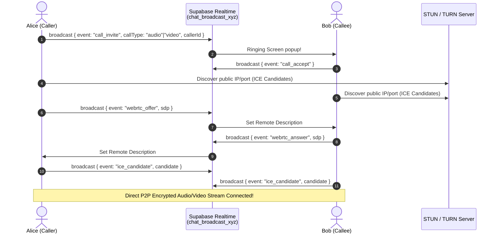

# AlaText Audio & Video Calling Feature Blueprint

## Overview
This document outlines the complete architectural design, data schemas, signaling protocol, cross-platform media bridge, and UI/UX plans for introducing 1-on-1 and group audio/video calling into **AlaText**.

---

## 1. Architectural Strategy

```
                                  ┌─────────────────────────────────────────────────────────┐
                                  │                Which approach is best?                  │
                                  └──────────────────────────┬──────────────────────────────┘
                                                             │
                             ┌───────────────────────────────┴───────────────────────────────┐
                             ▼                                                               ▼
        ┌─────────────────────────────────────────┐                     ┌─────────────────────────────────────────┐
        │       Option A: Pure P2P WebRTC         │                     │        Option B: LiveKit Cloud / SFU    │
        │       (Via Supabase Signaling)          │                     │        (Managed / Low Maintenance)      │
        ├─────────────────────────────────────────┤                     ├─────────────────────────────────────────┤
        │ • 100% Free / near-zero cost            │                     │ • Handled media servers (SFU)           │
        │ • Uses existing Supabase Realtime       │                     │ • Outstanding for 1-on-1 AND group calls│
        │ • End-to-end encrypted (DTLS-SRTP)      │                     │ • Auto-handles adaptive bitrates        │
        │ • Perfect for 1-on-1 calls              │                     │ • Official React Native & Web SDKs      │
        │ • Requires STUN/TURN server for NAT     │                     │ • Free tier available (100 GB/month)    │
        └─────────────────────────────────────────┘                     └─────────────────────────────────────────┘
```

### Recommendation
For AlaText's private, romantic, and lightweight nature, **Option A (Pure P2P WebRTC with Supabase Realtime Broadcast Signaling)** is optimal:
- Zero extra server infrastructure costs.
- Leverages the existing Supabase Realtime broadcast channels (`chat_broadcast_${chatId}`).
- End-to-end encryption (DTLS-SRTP).

---

## 2. WebRTC Signaling Flow via Supabase Realtime



---

## 3. Database Schema

Create a `call_sessions` table in Supabase to track active and historical calls:

```sql
CREATE TABLE public.call_sessions (
    id UUID PRIMARY KEY DEFAULT gen_random_uuid(),
    chat_id UUID REFERENCES public.chats(id) ON DELETE CASCADE,
    caller_id UUID REFERENCES auth.users(id),
    receiver_id UUID REFERENCES auth.users(id),
    call_type TEXT CHECK (call_type IN ('audio', 'video')),
    status TEXT CHECK (status IN ('ringing', 'ongoing', 'ended', 'declined', 'missed')) DEFAULT 'ringing',
    duration_seconds INT DEFAULT 0,
    started_at TIMESTAMPTZ,
    ended_at TIMESTAMPTZ,
    created_at TIMESTAMPTZ DEFAULT timezone('utc'::text, now())
);

-- Indexing for chat lookup
CREATE INDEX idx_call_sessions_chat_id ON public.call_sessions(chat_id);
```

When a call concludes or is missed, append an entry into `messages` table with `type: 'system'` or `type: 'call'` (e.g. `"📞 Call ended • 14m 23s"` or `"📵 Missed audio call"`).

---

## 4. STUN & TURN Relay Configuration

```typescript
// src/lib/webrtcConfig.ts
export const RTC_PEER_CONFIG: RTCConfiguration = {
  iceServers: [
    { urls: 'stun:stun.l.google.com:19302' },
    { urls: 'stun:stun1.l.google.com:19302' },
    // Free production TURN relay (e.g. Metered.ca, Twilio, or Cloudflare Calls):
    // {
    //   urls: "turn:openrelay.metered.ca:80",
    //   username: "openrelayproject",
    //   credential: "openrelayproject",
    // },
  ],
};
```

---

## 5. Signaling Protocol Definition

```typescript
// Call state definitions:
export type CallStatus = 'idle' | 'calling' | 'ringing' | 'connected' | 'ended';

export interface CallSignalPayload {
  chatId: string;
  callerId: string;
  callerName: string;
  callerAvatar?: string;
  callType: 'audio' | 'video';
  sdp?: any;
  candidate?: any;
}
```

### Broadcast Events
1. `call:invite` — Caller initiates call, Callee displays incoming call screen.
2. `call:accept` — Callee picks up; both sides initiate local media stream.
3. `call:decline` — Callee declines; Caller plays busy tone / resets UI.
4. `call:offer` — Caller sends SDP Offer.
5. `call:answer` — Callee sends SDP Answer.
6. `call:candidate` — Trickle ICE candidate exchange.
7. `call:end` — Either party hangs up; tears down `RTCPeerConnection` and stops media tracks.

---

## 6. Cross-Platform WebRTC Bridge (Web vs. Native)

- **Web**: Supported out-of-the-box via browser APIs (`window.RTCPeerConnection`, `navigator.mediaDevices.getUserMedia`).
- **iOS / Android (Expo Native)**: Install `react-native-webrtc` with its Expo config plugin:
  ```bash
  npx expo install react-native-webrtc
  ```
  In `app.json`:
  ```json
  {
    "plugins": [
      [
        "@config-plugins/react-native-webrtc",
        {
          "cameraPermission": "Allow AlaText to use your camera for video calls.",
          "microphonePermission": "Allow AlaText to use your microphone for voice calls."
        }
      ]
    ]
  }
  ```

Unified import adapter:
```typescript
// src/lib/webrtcAdapter.ts
import { Platform } from 'react-native';

export const getMediaDevices = () => {
  if (Platform.OS === 'web') return navigator.mediaDevices;
  const { mediaDevices } = require('react-native-webrtc');
  return mediaDevices;
};

export const getRTCPeerConnection = () => {
  if (Platform.OS === 'web') return window.RTCPeerConnection;
  const { RTCPeerConnection } = require('react-native-webrtc');
  return RTCPeerConnection;
};
```

---

## 7. UI Components Specification

1. **Header Call Buttons** (in `src/app/chat.tsx`):
   - Hook up `Phone` and `Video` icons to trigger `startCall('audio')` and `startCall('video')`.
2. **Incoming Call Modal** (`src/components/IncomingCallModal.tsx`):
   - Fullscreen / floating overlay with glowing avatar pulse (`AppleIntelligenceGlow`).
   - Accept (green) & Decline (red) buttons.
   - Ringtone audio playback.
3. **Active Call Screen / Floating Window** (`src/components/ActiveCallModal.tsx`):
   - **Voice Call**: Dark AMOLED / theme background, circular avatar with live volume ring, call timer (`00:00`), Mute Mic, Speaker Toggle, End Call.
   - **Video Call**: Fullscreen remote video stream, PiP local camera preview in corner, Flip Camera, Turn Off Camera, Mute, End Call.
   - **Minimizable**: Picture-in-picture floating pill so users can continue messaging while on call.

---

## 8. Phased Implementation Roadmap

- **Phase 1**: Web 1-on-1 Voice Calling (Signaling hook + browser WebRTC audio).
- **Phase 2**: Web Video Calling & Call Screen Modal (Video rendering + controls).
- **Phase 3**: Native Mobile Support (`react-native-webrtc` + CallKit/Push).
- **Phase 4**: Call history logs & chat bubble summaries.
