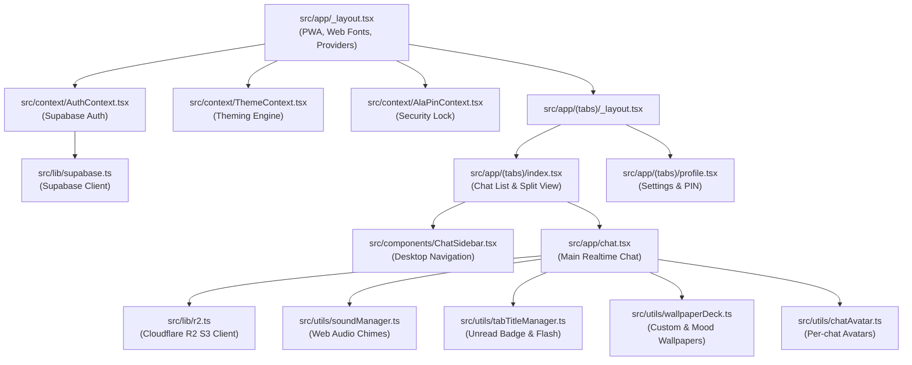

# AlaText Codebase Map & Module Directory

> **Purpose**: Use this map to navigate directly to the specific files and line regions needed for any task without re-reading the entire codebase. This saves tokens, avoids accidental regressions, and clarifies upstream/downstream dependencies.

---

## 🗺️ Architectural Overview & Data Flow

---

## 🎯 Feature-to-File Matrix ("Touch Guide")

When working on a feature, **only read and touch the files listed in that row**. Check the "Dependencies / Watch Out For" column before editing.

| Feature / Domain | Primary Files to Touch | Subcomponents & Helpers | External / Shared Libs | Dependencies / Watch Out For |
| :--- | :--- | :--- | :--- | :--- |
| **Notification Sounds & Chimes** | [`src/utils/soundManager.ts`](file:///home/opc/.gemini/antigravity-cli/scratch/alatext/src/utils/soundManager.ts) | [`src/components/ChatSettingsModal.tsx`](file:///home/opc/.gemini/antigravity-cli/scratch/alatext/src/components/ChatSettingsModal.tsx) (sound selector UI) | Web Audio API, `AsyncStorage` | Browser autoplay policies require user interaction before `AudioContext.resume()`. Incoming message trigger is in `chat.tsx`. |
| **Web Tab Badge & Title Flashing** | [`src/utils/tabTitleManager.ts`](file:///home/opc/.gemini/antigravity-cli/scratch/alatext/src/utils/tabTitleManager.ts) | None | Browser `document.title` | Runs only on `Platform.OS === 'web'`. Reset count when window gains focus or chat is opened. |
| **Colon Emoji Autocomplete** | [`src/components/EmojiAutocomplete.tsx`](file:///home/opc/.gemini/antigravity-cli/scratch/alatext/src/components/EmojiAutocomplete.tsx) | [`src/components/CustomEmojiPicker.tsx`](file:///home/opc/.gemini/antigravity-cli/scratch/alatext/src/components/CustomEmojiPicker.tsx) (`EMOJI_DATABASE`) | React Native TextInput | Triggered in `chat.tsx` on input text changes containing `:[a-zA-Z0-9_-]+`. Keyboard navigation (`Tab`, `Enter`, `Arrows`). |
| **Custom Emoji Drawer** | [`src/components/CustomEmojiPicker.tsx`](file:///home/opc/.gemini/antigravity-cli/scratch/alatext/src/components/CustomEmojiPicker.tsx) | None | [`src/context/ThemeContext.tsx`](file:///home/opc/.gemini/antigravity-cli/scratch/alatext/src/context/ThemeContext.tsx) | Category tabs, search filtering, recent emoji local persistence in `AsyncStorage`. |
| **Glassmorphic Keyboard & Glide Typing** | [`src/components/AlaGlassKeyboard.tsx`](file:///home/opc/.gemini/antigravity-cli/scratch/alatext/src/components/AlaGlassKeyboard.tsx) | [`src/lib/slideTyping.ts`](file:///home/opc/.gemini/antigravity-cli/scratch/alatext/src/lib/slideTyping.ts) | PanResponder / GestureHandler | Slide typing calculates gesture path against word coordinates in `COMMON_WORDS`. |
| **Chat-Specific Profile Photos** | [`src/utils/chatAvatar.ts`](file:///home/opc/.gemini/antigravity-cli/scratch/alatext/src/utils/chatAvatar.ts) | [`src/components/ChatSettingsModal.tsx`](file:///home/opc/.gemini/antigravity-cli/scratch/alatext/src/components/ChatSettingsModal.tsx) (picker) | [`src/lib/r2.ts`](file:///home/opc/.gemini/antigravity-cli/scratch/alatext/src/lib/r2.ts), [`src/lib/supabase.ts`](file:///home/opc/.gemini/antigravity-cli/scratch/alatext/src/lib/supabase.ts) | Stored in `chat_settings` or `chat_avatars` table and cached locally in `@chat_${chatId}_chat_avatars`. Broadcasts over realtime channel. |
| **Wallpaper Deck & Mood Triggers** | [`src/utils/wallpaperDeck.ts`](file:///home/opc/.gemini/antigravity-cli/scratch/alatext/src/utils/wallpaperDeck.ts) | [`src/components/ParallaxWallpaper.tsx`](file:///home/opc/.gemini/antigravity-cli/scratch/alatext/src/components/ParallaxWallpaper.tsx), [`src/components/ChatSettingsModal.tsx`](file:///home/opc/.gemini/antigravity-cli/scratch/alatext/src/components/ChatSettingsModal.tsx) | [`src/lib/supabase.ts`](file:///home/opc/.gemini/antigravity-cli/scratch/alatext/src/lib/supabase.ts) | Multi-slot wallpaper system (`slot_1` to `slot_5`). Moods (`love`, `night`, `day`) automatically switch slots if enabled. |
| **Sleepy Bye / Bedtime Blocker** | [`src/components/SleepyByeBlocker.tsx`](file:///home/opc/.gemini/antigravity-cli/scratch/alatext/src/components/SleepyByeBlocker.tsx) | [`src/lib/byeDetector.ts`](file:///home/opc/.gemini/antigravity-cli/scratch/alatext/src/lib/byeDetector.ts), [`src/lib/sleepyByeQuotes.ts`](file:///home/opc/.gemini/antigravity-cli/scratch/alatext/src/lib/sleepyByeQuotes.ts), [`src/components/BlurRevealShimmerText.tsx`](file:///home/opc/.gemini/antigravity-cli/scratch/alatext/src/components/BlurRevealShimmerText.tsx) | `AsyncStorage` | Activates when repetitive "bye" messages are exchanged late at night. User can unlock via holding or timer. |
| **Love Messages & Floating Hearts** | [`src/components/FloatingHearts.tsx`](file:///home/opc/.gemini/antigravity-cli/scratch/alatext/src/components/FloatingHearts.tsx), [`src/components/HeartPing.tsx`](file:///home/opc/.gemini/antigravity-cli/scratch/alatext/src/components/HeartPing.tsx) | [`src/lib/loveDetector.ts`](file:///home/opc/.gemini/antigravity-cli/scratch/alatext/src/lib/loveDetector.ts) | `react-native-reanimated` | `isLoveMessage()` inspects message text for romantic expressions and heart emojis to trigger floating burst animations. |
| **Voice Notes & Audio Recording** | [`src/components/VoiceRecorder.tsx`](file:///home/opc/.gemini/antigravity-cli/scratch/alatext/src/components/VoiceRecorder.tsx) | [`src/components/AudioPlayerBubble.tsx`](file:///home/opc/.gemini/antigravity-cli/scratch/alatext/src/components/AudioPlayerBubble.tsx) | [`src/lib/r2.ts`](file:///home/opc/.gemini/antigravity-cli/scratch/alatext/src/lib/r2.ts) (`uploadAudioToR2`) | Web MediaRecorder API or Native Audio Record. Audio saved as Base64/Blob to Cloudflare R2 bucket. |
| **Video Playback in Chat** | [`src/components/VideoPlayerBubble.tsx`](file:///home/opc/.gemini/antigravity-cli/scratch/alatext/src/components/VideoPlayerBubble.tsx) | [`src/lib/r2.ts`](file:///home/opc/.gemini/antigravity-cli/scratch/alatext/src/lib/r2.ts) (`uploadVideoToR2`) | HTML5 Video / Expo Video | Handles video buffering, play/pause toggles, and inline sizing. |
| **Image Lightbox & Zoom** | [`src/components/ZoomableImageViewer.tsx`](file:///home/opc/.gemini/antigravity-cli/scratch/alatext/src/components/ZoomableImageViewer.tsx) | None | Gestures / Reanimated | Pinch-to-zoom, pan, swipe down to dismiss. |
| **Stickers & Custom Pack Upload** | [`src/components/StickerPicker.tsx`](file:///home/opc/.gemini/antigravity-cli/scratch/alatext/src/components/StickerPicker.tsx) | None | [`src/lib/r2.ts`](file:///home/opc/.gemini/antigravity-cli/scratch/alatext/src/lib/r2.ts), [`src/lib/supabase.ts`](file:///home/opc/.gemini/antigravity-cli/scratch/alatext/src/lib/supabase.ts) | Custom stickers uploaded to R2 and cataloged in Supabase table. |
| **Message Formatting & Rich Text** | [`src/lib/formatText.tsx`](file:///home/opc/.gemini/antigravity-cli/scratch/alatext/src/lib/formatText.tsx) | [`src/components/ShinyText.tsx`](file:///home/opc/.gemini/antigravity-cli/scratch/alatext/src/components/ShinyText.tsx) | None | Parses bold (`**`), italic (`*`), spoiler (`||`), and love heart pulsations. |
| **App Lock PIN & Security** | [`src/context/AlaPinContext.tsx`](file:///home/opc/.gemini/antigravity-cli/scratch/alatext/src/context/AlaPinContext.tsx) | [`src/components/AlaPinLockScreen.tsx`](file:///home/opc/.gemini/antigravity-cli/scratch/alatext/src/components/AlaPinLockScreen.tsx), [`src/components/AlaPinSettingsModal.tsx`](file:///home/opc/.gemini/antigravity-cli/scratch/alatext/src/components/AlaPinSettingsModal.tsx) | `AsyncStorage` | Global lock state wrapped at root layout. Triggers when inactive or backgrounded. |
| **Theming & Appearance** | [`src/context/ThemeContext.tsx`](file:///home/opc/.gemini/antigravity-cli/scratch/alatext/src/context/ThemeContext.tsx) | [`src/constants/theme.ts`](file:///home/opc/.gemini/antigravity-cli/scratch/alatext/src/constants/theme.ts), [`src/components/AlaContextMenu.tsx`](file:///home/opc/.gemini/antigravity-cli/scratch/alatext/src/components/AlaContextMenu.tsx) | CSS Variables (web) | Supports Dark, Light, AMOLED, and custom accent palettes. |
| **Web Push Notifications** | [`src/lib/push.ts`](file:///home/opc/.gemini/antigravity-cli/scratch/alatext/src/lib/push.ts) | [`public/sw.js`](file:///home/opc/.gemini/antigravity-cli/scratch/alatext/public/sw.js) | VAPID, Supabase | Push subscription synced with Supabase `push_subscriptions` table. |
| **Desktop / Web Responsive Shell** | [`src/components/ChatSidebar.tsx`](file:///home/opc/.gemini/antigravity-cli/scratch/alatext/src/components/ChatSidebar.tsx) | [`src/components/DesktopLandingPlaceholder.tsx`](file:///home/opc/.gemini/antigravity-cli/scratch/alatext/src/components/DesktopLandingPlaceholder.tsx), [`src/app/(tabs)/index.tsx`](file:///home/opc/.gemini/antigravity-cli/scratch/alatext/src/app/(tabs)/index.tsx) | `react-native-web` | Split column view rendered on desktop screen sizes. |

---

## 🔍 Internal Anatomy of `src/app/chat.tsx`

`src/app/chat.tsx` is the primary chat screen. **Do not read the full 4,600+ lines.** Jump directly to these line sections:

| Line Range | Section / Component | What It Does |
| :--- | :--- | :--- |
| **1 – 100** | **Imports & Types** | `Message` interface, icon imports, helpers, `SendingDots` indicator |
| **101 – 450** | **State, Refs & Contexts** | Active chat state, messages array, user session, themes, sound config, wallpaper refs |
| **451 – 750** | **Realtime Subscriptions** | Supabase channel listener for `INSERT`, `UPDATE`, `DELETE`, presence, and partner typing |
| **751 – 1100** | **Message Loading & Pagination** | `fetchMessages()`, load earlier messages on scroll, read receipts sync |
| **1101 – 1650** | **Send, Edit & Media Upload** | `handleSend()`, optimistic updates, image/video pickers, R2 upload triggers |
| **1651 – 2100** | **Shortcuts & Input Event Handlers** | PC keyboard shortcuts (Ctrl+Enter, Esc, etc.), colon emoji detection, mention parser |
| **2101 – 2750** | **Modals & Overlays Integration** | Settings modal, Info modal, Doodle overlay, SleepyBye, Lightbox openers |
| **2751 – 3448** | **Chat Screen JSX Render Tree** | Header, message FlatList, date headers, mobile toolbar, input dock |
| **3449 – 3901** | **`createStyles()`** | Dynamic stylesheet generator supporting AMOLED and theme colors |
| **3902 – 3945** | **`DynamicImage`** | Calculates aspect ratio and renders smooth fading image attachments |
| **3946 – 4015** | **`MediaAlbumGrid`** | WhatsApp-style clumped grid layout for multiple photo/video messages |
| **4016 – 4116** | **`MessageHoverActions`** | Floating quick action pill on desktop hover (Reply, React, Edit, Delete, Pin) |
| **4117 – 4648** | **`MessageRow`** | Individual message renderer: bubble shape, reaction pills, replies, status checkmarks |

---

## ⚙️ Cloud Services & Environment Configuration

| Service | Client Config File | Environment Variables Needed in `.env` | Primary Usage |
| :--- | :--- | :--- | :--- |
| **Supabase** | [`src/lib/supabase.ts`](file:///home/opc/.gemini/antigravity-cli/scratch/alatext/src/lib/supabase.ts) | `EXPO_PUBLIC_SUPABASE_URL` `EXPO_PUBLIC_SUPABASE_ANON_KEY` | Auth, realtime database, chat participants, message sync |
| **Cloudflare R2** | [`src/lib/r2.ts`](file:///home/opc/.gemini/antigravity-cli/scratch/alatext/src/lib/r2.ts) | `EXPO_PUBLIC_R2_ACCESS_KEY_ID` `EXPO_PUBLIC_R2_SECRET_ACCESS_KEY` `EXPO_PUBLIC_R2_ENDPOINT` `EXPO_PUBLIC_R2_PUBLIC_URL` `EXPO_PUBLIC_R2_BUCKET_NAME` | Media storage for avatars, chat images, voice notes, videos, custom stickers |

---

## 🚀 Recommended Safe Workflow for Code Modifications

1. **Check the Matrix**: Identify the feature row above.
2. **Target Specific Lines**: If modifying `src/app/chat.tsx`, refer to the Line Range table and inspect only that specific section.
3. **Check Downstream Dependents**: Ensure changes do not break mobile vs web platform branching (`Platform.OS === 'web'`).
4. **Validate Compilation**: Run `npx tsc --noEmit` to verify type safety immediately after any change.
