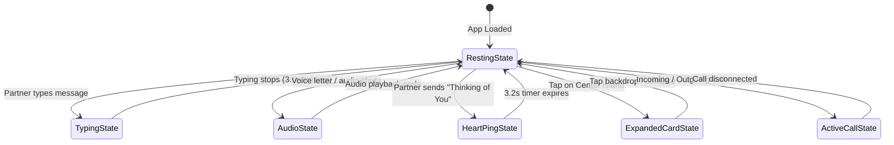

# AlaText Dynamic Island & Floating Header System
## Complete Design Specification, Interaction Blueprint & UI Consultation Brief

> **Document Version**: 2.0.0  
> **Status**: Production Reference & UI/UX Specialist Review Document  
> **Target Audience**: UI/UX Designers, Product Architects, Motion Specialists, Mobile Engineers  
> **Component Implementation**: [`src/app/chat.tsx`](file:///home/opc/.gemini/antigravity-cli/scratch/alatext/src/app/chat.tsx), [`src/components/DynamicIslandVisuals.tsx`](file:///home/opc/.gemini/antigravity-cli/scratch/alatext/src/components/DynamicIslandVisuals.tsx), [`src/utils/notchConfig.ts`](file:///home/opc/.gemini/antigravity-cli/scratch/alatext/src/utils/notchConfig.ts)

---

## 📖 1. Design Vision & Philosophy

The **AlaText Dynamic Island** transforms a physical hardware liability—the front camera punch-hole cutout on modern smartphones—into a **living, emotional anchor** for interpersonal connection.

In standard chat applications, the top of the screen is an uninspired navigation bar. In AlaText, this space functions as an **ambient presence layer**:
1. **Physical Masking**: Anchors directly around the camera hole using pure OLED Jet Black (`#000000`), turning the dead physical sensor into part of the UI.
2. **Emotional Complications**: Communicates partner presence, live audio playback, voice calls, typing state, and romantic "Thinking of You" pings without interrupting conversation flow.
3. **Tactile Spring Physics**: Driven by spring dynamics (`friction: 6`, `tension: 85`), providing tactile elasticity when expanding or collapsing.
4. **Ambient Backglow Aura**: Rather than tinting the physical island body, ambient colored light radiates strictly **behind** the black capsule, casting a neon aura into the wallpaper.

---

## 📐 2. The Floating 3-Pill Header vs. Dynamic Island

AlaText employs a responsive, morphing tri-pill architecture at rest, which seamlessly unifies into a single Dynamic Island during active events:

```
┌────────────────────────────────────────────────────────────────────────┐
│                        RESTING STATE (TRI-PILL)                        │
│                                                                        │
│  ┌───────┐         ┌───────────────────────────────┐        ┌───────┐  │
│  │   <   │         │ (O)  Partner Name   ● Online  │        │ ❤️  ⋮ │  │
│  └───────┘         └───────────────────────────────┘        └───────┘  │
│  Left Pill                  Center Island                  Right Pill  │
│  (Navigation)          (Profile & Presence)            (Heart & More)  │
└────────────────────────────────────────────────────────────────────────┘

                                    │
                                    ▼ [EVENT: Heart Ping / Audio / Call]

┌────────────────────────────────────────────────────────────────────────┐
│                      ACTIVE MORPHING (DYNAMIC ISLAND)                  │
│                                                                        │
│   ┌────────────────────────────────────────────────────────────────┐   │
│   │  ❤️ Pulsing   [•••• CAMERA SAFE ZONE ••••]   Thinking of Mine ✨│   │
│   └────────────────────────────────────────────────────────────────┘   │
│          Left Pill & Right Pill smoothly collapse to width: 0          │
│          Center Island expands horizontally to full symmetrical width  │
└────────────────────────────────────────────────────────────────────────┘
```

---

## 🔄 3. State Machine & Visual Complications

AlaText's Dynamic Island supports **5 distinct operational states**:



---

### State 0: Resting Tri-Pill State
* **Left Pill (`headerBackPill`)**:
  * Shape: Circle / rounded pill (`effectivePillHeight`).
  * Icon: Back chevron (`<ChevronLeft size={24} />`) or sidebar drawer toggle on desktop.
* **Center Island (`headerProfilePill`)**:
  * Body: Solid OLED Jet Black (`#000000`) with subtle glass border (`rgba(255, 255, 255, 0.12)`).
  * Left: 36px circular avatar with cached photo or initials fallback.
  * Right: Partner nickname (styled with custom chat font) and online presence dot or "Last seen Xm ago".
* **Right Pill (`headerActionsPill`)**:
  * Shape: Capsule holding two interactive triggers:
    1. **Heart Button**: Direct trigger for sending a romantic "Thinking of You" heart ping.
    2. **More Options (`⋮`)**: Opens the secondary actions dropdown (Chat info, wallpapers, settings, search).

---

### State 1: Live Audio & Typing Complications
When the island is at resting height (46px) but an ambient event occurs:
* **Audio Playback**:
  * The right side of the center island morphs into a live **4-bar equalizer** (`DynamicEqualizerBars`), pulsing asynchronously to simulate sound waves.
  * Subtitle shifts to green: `Playing [Voice Letter Name]...`.
* **Partner Typing**:
  * Subtitle shifts to accent color with real-time jumping dots (`DynamicTypingDots`).
  * If ghost typing is enabled, the actual live keystrokes gently fade in.

---

### State 2: "Thinking of You" Heart Ping State
Triggered when either partner taps the Heart button or sends romantic affection.

```
┌────────────────────────────────────────────────────────────────────────────┐
│                    "THINKING OF YOU" COMPLICATION LAYOUT                   │
│                                                                            │
│   ┌────────────────────┬──────────────────────┬────────────────────────┐   │
│   │    LEFT FLANK      │  CENTER DEAD-ZONE    │      RIGHT FLANK       │   │
│   │     (flex: 1)      │    (width: 48px)     │       (flex: 1)        │   │
│   │                    │                      │                        │   │
│   │     ❤️ Pulsing     │   [CAMERA HOLE]      │    Thinking of Mine ✨ │   │
│   │    (HeartAnim)     │  Clean OLED Glass    │      (ShinyText)       │   │
│   └────────────────────┴──────────────────────┴────────────────────────┘   │
│                                                                            │
│   <<<<< AMBIENT PINK UNDERGLOW AURA RADIATES BEHIND THE CAPSULE >>>>>>    │
└────────────────────────────────────────────────────────────────────────────┘
```

#### Key Technical & Visual Details:
1. **Pure OLED Jet Black Body**:
   * The pill body is 100% solid `#000000`.
   * `backdropFilter: "none"` is explicitly enforced so no background wallpaper colors bleed into the pill body.
2. **Ambient Underglow Aura**:
   * Radiates **behind** and outside the pill using layered CSS box-shadow:
     ```css
     box-shadow: 0 0 28px rgba(244, 63, 94, 0.35), 0 4px 30px rgba(244, 63, 94, 0.22);
     ```
   * Accompanied by the screen-edge `AppleIntelligenceGlow` at `zIndex: 15` (strictly below the header at `zIndex: 100`), ensuring the pill acts as a physical cutout on top of the glowing aura.
3. **Camera Punch-Hole Safe Clearance**:
   * **Problem**: Most modern smartphones have a centered front camera punch-hole cutout at `x = 50%`. Centered text previously ran straight through this hole.
   * **Solution**: Symmetrical 3-part layout:
     * **Left Flank (`flex: 1`)**: Houses the pulsing Heart complication (`❤️`) with cardiac scale bounce.
     * **Center Spacer (`width: 48px`)**: Mathematically guaranteed empty black space centered at `50%`. The physical camera lens rests in clean, unoccluded space.
     * **Right Flank (`flex: 1`)**: Houses the shiny shimmering text (`Thinking of [Partner]...`), strictly to the right of the camera hole, with `numberOfLines={1}` and ellipsis truncation.
4. **4-Cycle Rhythmic Human Heartbeat Haptics**:
   * Vibration pattern simulating a realistic dual-pulse human heartbeat:
     ```typescript
     // [vibrate, pause, vibrate, rest between beats...]
     const HEARTBEAT_PATTERN = [70, 80, 140, 420, 70, 80, 140, 420, 70, 80, 140, 420, 70, 80, 140];
     ```

---

### State 3: Interactive Expanded Island Dashboard (Tap to Open)
Tapping the center island at any time springs open the **Interactive Dashboard Card** (`height: 124px – 245px`):

```
┌────────────────────────────────────────────────────────────────────────┐
│                        EXPANDED ISLAND DASHBOARD                       │
│                                                                        │
│   ┌──────┐  Partner Name                    [ 🥰 Loved · 4h left ]     │
│   │ AVTR │  ● Active now                    Mood Status Chip           │
│   └──────┘                                                             │
│   ──────────────────────────────────────────────────────────────────   │
│   🧭 Couple Compass & Distance Radar                                   │
│      [ ↗ 14.2 km Away ]        [ 📍 Partner in Paris · 8m ago ]        │
│   ──────────────────────────────────────────────────────────────────   │
│   [ 📞 Audio Call ]    [ 📹 Video Call ]    [ ❤️ Send Heart Ping ]     │
│                                                                        │
│                          ▲ Tap to Collapse                             │
└────────────────────────────────────────────────────────────────────────┘
```

#### Modules Inside the Expanded Island:
1. **Partner Header & Mood Chip**:
   * Circular avatar, display name, and last-seen indicator.
   * **6-Hour Ephemeral Mood Chip**: Shows current partner mood (e.g. `🥰 Loved`, `😴 Sleepy`, `🥺 Missing You`). Tapping opens the Mood Selector modal.
2. **Couple Compass & Distance Radar**:
   * **Distance**: Computes geodesic distance using Haversine formula (km or miles).
   * **Live Bearing Arrow**: Real-time rotating compass needle pointing in the physical direction of the partner.
   * **Privacy & Auto-Expiry**: Updates every 20 minutes; cached locations automatically purge after 40 minutes (2 pings) to protect user privacy.
3. **Quick Action Controls**:
   * **Start Audio Call**: Initiates WebRTC audio call directly from the island.
   * **Start Video Call**: Launches HD video session.
   * **Heart Ping**: Triggers immediate love pulse.
4. **Full Profile Transition**:
   * Tapping the partner avatar inside the expanded island triggers a smooth spring expansion that morphs directly into the **Chat Info / Profile** screen without abrupt navigation jumps.

---

### State 4: Active Calling Complication
When an audio or video call is in progress:
* **Calling / Ringing**: Dynamic island expands to 168px height with animated pulsing rings and call type badge (`HD Video Call...` or `HD Audio Call...`).
* **Connected**:
  * Live duration timer formatted as `MM:SS` updated every second.
  * In-island quick controls: Mic Mute, Video Camera Toggle, and Red End Call button.
  * If video is active, local and remote video streams embed directly into the island card.

---

## ⚙️ 4. Hardware Calibration & Notch Geometry Engine

Because Android and iOS devices feature varying camera hole sizes, positions, and screen curvatures, AlaText includes a dedicated **Hardware Notch Calibration Engine** ([`src/utils/notchConfig.ts`](file:///home/opc/.gemini/antigravity-cli/scratch/alatext/src/utils/notchConfig.ts)):

```
CALIBRATION PARAMETERS:
├── Mode:
│   ├── Dynamic Island   → Centered island anchored around camera hole
│   ├── Camera Breathe   → Drops header 10px below camera for clean clearance
│   ├── Corner Edge Dot  → Designed for left/right hole-punch cameras
│   └── Classic Floating → Standard desktop / flat layout
├── Top Offset:           -15px to +35px (fine-tune vertical alignment)
├── Island Height:        38px to 54px (standard: 46px)
├── Width Ratio:          0.85 to 1.0 (compact pill vs edge-to-edge)
├── Border Radius:        28px to 48px (squircle curvature tuning)
└── Camera Target Guide:  Overlay crosshair reticle for pixel-perfect alignment
```

---

## 🎨 5. Layering & zIndex Architecture

To ensure light effects radiate **behind** UI elements without tinting the solid OLED black surfaces, AlaText enforces strict viewport zIndex stacking:

| Layer | Component | zIndex | Purpose |
| :--- | :--- | :---: | :--- |
| **Top Overlay** | More Dropdown Menu | `120` | Floats above all header controls |
| **Header Surface** | `floatingHeaderWrapper` | `100` | Contains the 3-pill floating island and back button |
| **Interactive Modals** | Mood Picker & Settings | `90` | Overlays chat messages |
| **Screen Edge Aura** | `AppleIntelligenceGlow` | `15` | Multi-corner gradient glow along screen edges |
| **Message Stream** | FlatList & Chat Bubbles | `1` | Core conversation feed |
| **Base Wallpaper** | `ParallaxWallpaper` | `0` | Background canvas and parallax motion layer |

---

## 💡 6. UI/UX Specialist Consultation Brief

As we collaborate with UI/UX specialists and product designers to elevate this system, consider the following focus areas:

### Key Questions for the Specialist:

1. **Resting State Micro-Delights**:
   * What subtle animations or indicators could live in the resting 46px pill when neither user is actively typing? (e.g., subtle partner battery level, local weather icon, time zone difference, or tiny breathing glow)?
2. **Gesture & Physics Polish**:
   * Currently, tapping expands the island. Would a **swipe-down gesture** feel more natural?
   * When the island is expanded, should pulling down further transition directly into the Shared Vault / Memories screen?
3. **Visual Hierarchy of the Expanded Card**:
   * How can we best balance the **Couple Compass & Distance Radar** with the **6-Hour Mood Chip** without feeling overcrowded on smaller screens (e.g. iPhone SE / 360px Android devices)?
4. **Transition to Profile Screen**:
   * What is the smoothest visual choreography to transition from the expanded island card into the full `chat-info.tsx` profile screen? (e.g., shared element transition where the island card scales to become the profile header banner)?
5. **Secondary Ambient Complications**:
   * What other couple-centric events warrant Dynamic Island morphing? (e.g., "Partner just woke up", "Shared anniversary countdown milestone reached", "Partner started listening to a song")?
6. **Sound & Audio-Haptic Synergy**:
   * How can gentle audio chimes (Web Audio synth tones) be synchronized with the 4-cycle heartbeat haptic to create a multisensory experience?
